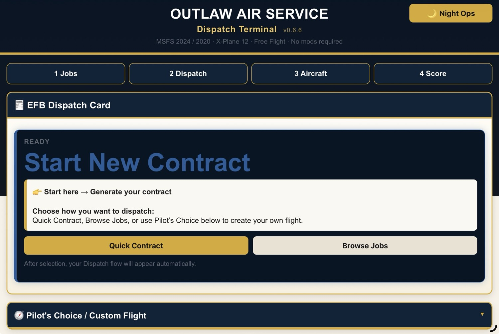
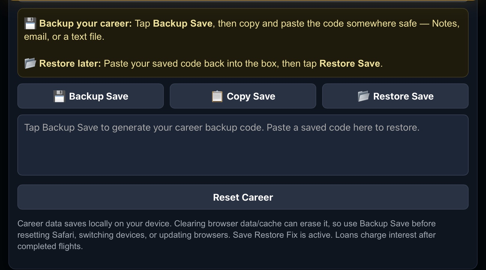

# ✈️ Outlaw Air Service — Dispatch Terminal (MSFS 2020 / 2024 • X-Plane • Console & PC)

Give Free Flight a purpose.

A lightweight, browser-based dispatch tool for flight simulators — built around quick contracts, pilot-driven results, and a simple career loop.

  

---

**Works on:**
- MSFS 2020 / 2024 (PC & Xbox)
- X-Plane (PC)
- Any setup that can run a browser (iPad, tablet, phone, second screen)

**No mods. No SimConnect. No plugins. No AI. No setup.**  
Just open it → generate a contract → fly → log the result.

---

## 📸 How it works

### 👉 1. Generate a contract

Tap → **Start here → Generate your contract**

- Quick Contract (fast, randomized)  
- Browse Jobs / Pilot’s Choice (more control)  

This is your entry point. Jump straight into a job or take control of your flight planning.

---

### 🧾 2. Get your mission

Your **EFB Dispatch Card** is your job sheet:

- Route (departure → arrival)  
- Aircraft (or use your own)  
- Distance + mission type  
- Estimated payout  
- **EFB timer target** (set this in-sim before takeoff)

This works like a real dispatch briefing—perfect for **console players without external tools** and **X-Plane users without plugins**.

---

### ⚠️ 3. Fly the mission (Honor System)

Fly the route in your simulator and apply results yourself.

Examples:
- Late arrival  
- Hard landing  
- Wrong runway  
- Weather / night bonuses  

This is intentional — you are the Pilot in Command.

No tracking. No automation. No background scripts.  
**Your flight = your results.**

---

### 💰 4. Complete the contract

After landing:

- Tap **Complete Contract**  
- Apply bonuses / penalties  
- Confirm payout  
- Stats update automatically  

This is the core loop — **fly → log → get paid → progress**

---

### 📊 5. Track your career

Everything is tracked:

- Cash / Debt  
- Rank / Tier  
- Flight log  
- Company stats  

Also includes:
- Loan system  
- Backup / Restore save  

This gives you a lightweight “career mode” without turning the sim into a management game.

---

### 💾 6. Backup / Restore your save

Protect your progress and move your career between devices.

- Export your current career save  
- Restore a previous backup  
- Transfer progress between browser, tablet, or PC  

This ensures your career is never lost and stays portable across your setup.

---

## 🧭 What This Is

Outlaw Air Service is a lightweight, **EFB-style dispatch tool for Free Flight** that adds structure without adding complexity.

It’s designed especially for:
- **Console pilots (Xbox)** who don’t have SimConnect access  
- **X-Plane users** who don’t want plugin-heavy setups  
- **PC users** who just want something fast and simple  

No installs. No external connections. No overhead.

---

## 🚀 Features

- 📦 Generate missions (random contracts)  
- 🧭 Custom flights (Pilot’s Choice)  
- 💰 Payout + cost tracking  
- ⏱️ Built around in-sim EFB timing  
- 📊 Career progression system  
- 💾 Manual Backup / Restore  
- 📱 Mobile + tablet optimized  
- 🎮 Console-friendly (Xbox / controller users)  
- 🖥️ Works alongside MSFS & X-Plane  

---

## 🧪 Status

**v0.6.6 — Final Beta (Release Ready)**

---

## 💙 Support

https://ko-fi.com/wacky_outlaw

---

## ⚠️ Disclaimer

Not affiliated with Microsoft Flight Simulator, Asobo Studio, Laminar Research, or X-Plane.

---

## 📄 License

This project is free to use and share.  
You are welcome to use it for personal use, modify it, and distribute it within the community.
