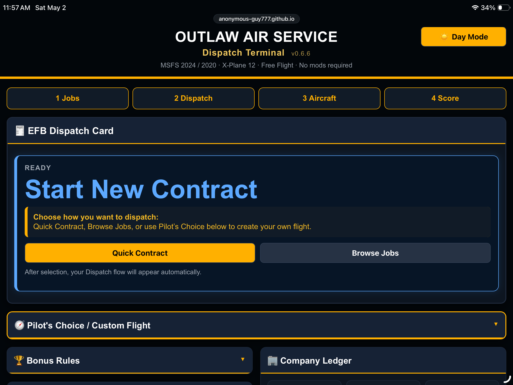
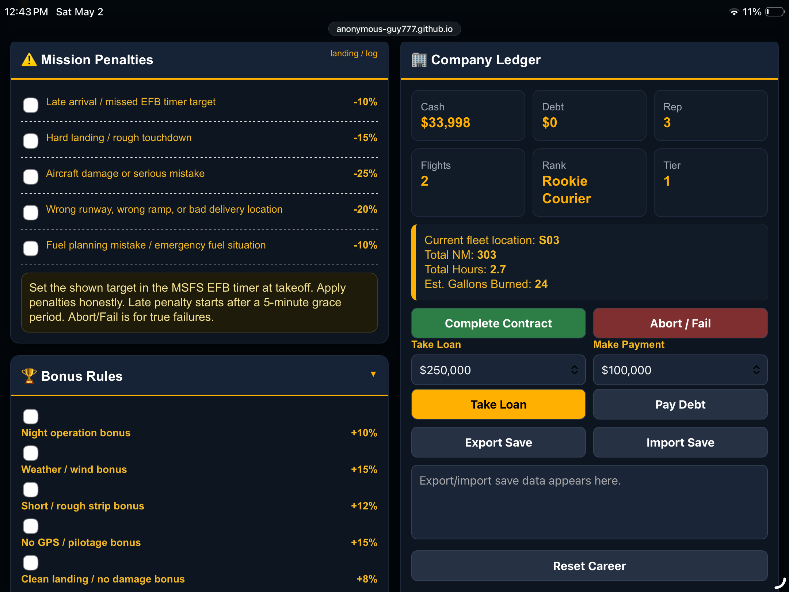
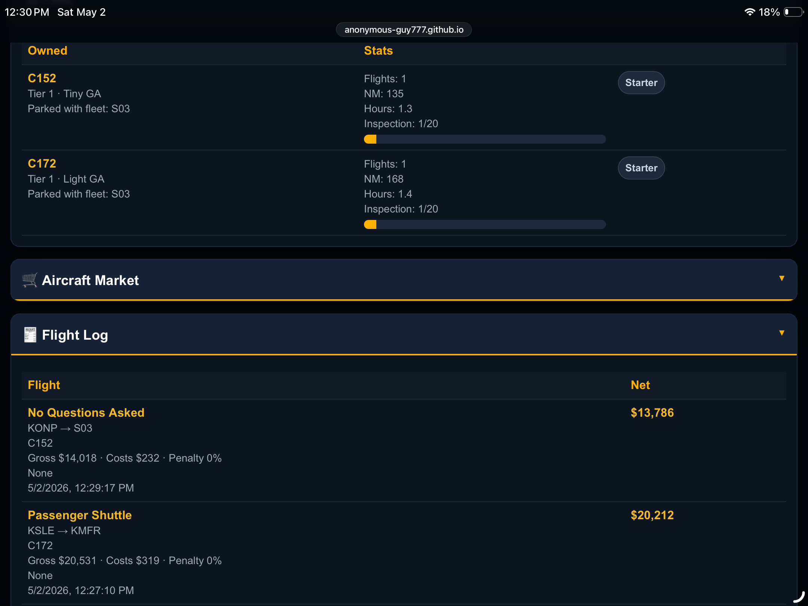
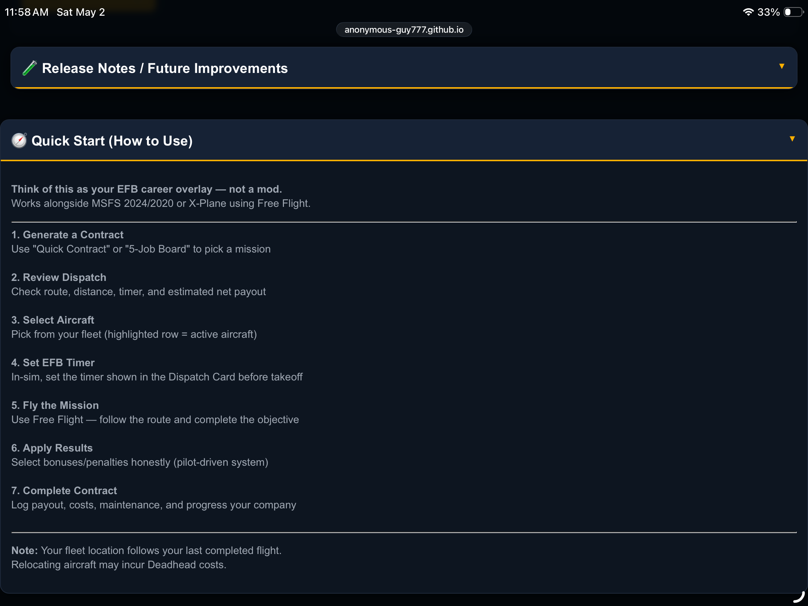

# ✈️ Outlaw Air Service — Dispatch Terminal

Give Free Flight a purpose.

A lightweight, browser-based dispatch tool for **flight simulators** (MSFS 2024/2020, X-Plane) — with missions, logbook tracking, and pilot-driven progression.

👉 **Launch the Dispatch Terminal:**  
https://anonymous-guy777.github.io/outlaw-air-service-dispatch/

---

## 🧭 What This Is

Outlaw Air Service is a lightweight, **EFB-style dispatch tool for Free Flight** that adds structure and progression.

No mods. No installs. No SimConnect. No AI.  
Saves locally — you can back up your career anytime with a simple copy/paste.  
Just open it on your phone or tablet and run it alongside your flight simulator.  

---

## 🚀 Features

- 📦 Generate missions (random contracts)  
- 🧭 Create custom flights (Pilot’s Choice)  
- 💰 Track payouts, costs, and progression  
- ⏱️ Built around the in-sim EFB timer  
- 💾 Manual **Backup / Restore Save system**  
- 📱 Mobile + tablet optimized (landscape preferred)  
- 🎮 Console-friendly (PS5 / Xbox)

---

## 💾 Save System (Important)

Your career saves locally in your browser.

You can back it up anytime using the built-in **Backup / Restore Save** feature:

- Tap **Backup Save** to generate your save code  
- Copy it to Notes, email, or a text file  
- Paste it back in and tap **Restore Save** to continue later  

⚠️ Clearing browser data, switching devices, or updating browsers can erase local saves unless you back them up.

---

## 📸 Screenshots

---

## 🛫 Supported Platforms

- MSFS 2024  
- MSFS 2020  
- X-Plane 12  

Works on PC, tablet, or alongside console flying.

---

## 🧠 How It Works

This is an **honor-system dispatch tool**.

Everything is manual — on purpose. You generate the flight, fly it, and log the results yourself.

Run it strictly with full penalties and bonuses, or keep it casual as a mission generator and logbook.

Your rules.

---

## 🧭 Quick Start

Think of this as your **EFB career overlay — not a mod.**

1. **Generate a Contract**  
2. **Review Dispatch** (route, distance, payout)  
3. **Select Aircraft**  
4. **Set EFB Timer in-sim**  
5. **Fly the Mission**  
6. **Apply Results (honestly)**  
7. **Complete Contract**

---

## 📱 Tip (iPad / Mobile)

Use **landscape mode** for the best experience.

You can also install it like an app:

- **iPad / iPhone (Safari):** Share → Add to Home Screen  
- **Android (Chrome):** Menu → Add to Home Screen  

---

## ✈️ Philosophy

**Everything is manual — on purpose.**

There’s no auto-pass system.

You are the one logging the flight:
- Bad landing? That’s on you  
- Weather bonus? You decide  
- Mission failed? You record it  

You are the **Pilot in Command**.

---

## 📲 Why This Exists

Free Flight is great — but it can feel directionless after a while.

This tool adds just enough structure to make each flight matter  
without turning it into a grind.

---

## 🛠️ Tech

- Single-file HTML app  
- No dependencies  
- Works offline  
- Hosted via GitHub Pages  

---

## 🧪 Status

**v0.6.6 — Final Beta (Release Ready)**  

Core system is stable.  
Recent updates include improved save reliability and restore support.

---

## 🔮 Roadmap (v0.7+)

- SimBrief launch support (external)  
- Expanded airport dataset  
- Optional economy tuning  
- More contract variety  

---

## 💙 Support

If you enjoy using this tool and want to support future updates:

Or visit: https://ko-fi.com/wacky_outlaw

---

## ⚠️ Disclaimer

Not affiliated with Microsoft Flight Simulator or Laminar Research.

This is a personal project built for the community.
