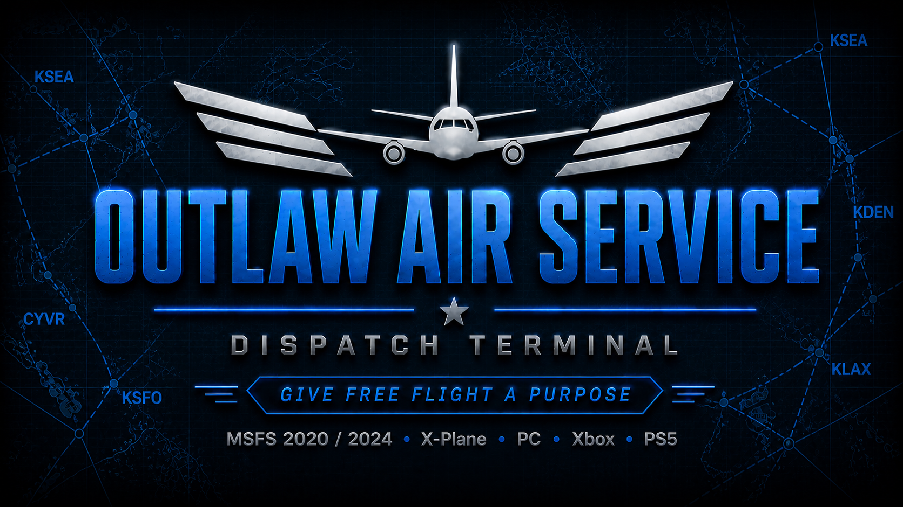

# ✈️ Outlaw Air Service — Dispatch Terminal (MSFS 2020 / 2024)

Give Free Flight a purpose.

A lightweight, browser-based dispatch tool for flight simulators — built around quick contracts, pilot-driven results, and a simple career loop.

  

---

**No mods. No SimConnect. No AI. No setup.**  
Just open it → generate a contract → fly → log the result.

---

## 📸 How it works

### 👉 1. Generate a contract

Tap → **Start here → Generate your contract**

- Quick Contract (fast, randomized)  
- Browse Jobs / Pilot’s Choice (more control)  

---

### 🧾 2. Get your mission

Your **EFB Dispatch Card** is your job sheet:

- Route (departure → arrival)  
- Aircraft (or use your own)  
- Distance + mission type  
- Estimated payout  
- **EFB timer target** (set this in-sim before takeoff)

---

### ⚠️ 3. Fly the mission (Honor System)

Fly the route in your sim and apply the results yourself.

Examples:
- Late arrival  
- Hard landing  
- Wrong runway  
- Weather/night bonuses  

This is intentional — you are the Pilot in Command.

---

### 💰 4. Complete the contract

After landing:

- Tap **Complete Contract**  
- Apply bonuses/penalties  
- Confirm payout  
- Stats update automatically  

This is the core loop — **fly → log → get paid → progress**

---

### 📊 5. Track your career

Everything is tracked:

- Cash / Debt  
- Rank / Tier  
- Flight log  
- Company stats  

Also includes:
- Loan system  
- Backup / Restore save  

---

## 🧭 What This Is

Outlaw Air Service is a lightweight, **EFB-style dispatch tool for Free Flight** that adds structure without turning it into a grind.

No mods. No installs. No external connections.

Run it on your phone or tablet alongside your simulator.

---

## 🚀 Features

- 📦 Generate missions (random contracts)  
- 🧭 Custom flights (Pilot’s Choice)  
- 💰 Payout + cost tracking  
- ⏱️ Built around in-sim EFB timing  
- 📊 Career progression system  
- 💾 Manual Backup / Restore  
- 📱 Mobile + tablet optimized  
- 🎮 Console-friendly (PS5 / Xbox)

---

## 💾 Save System (Important)

Your career saves locally in your browser.

- Tap **Backup Save** → copy your save code  
- Store it anywhere (Notes, email, text file)  
- Paste it back → tap **Restore Save**

⚠️ Clearing browser data or switching devices will erase saves unless backed up.

---

## 🛫 Supported Platforms

- MSFS 2024  
- MSFS 2020  
- X-Plane 12  

Works on PC, tablet, or alongside console flying.

---

## 🧠 Design Philosophy

Built around a **KISS approach (Keep It Simple & Straightforward)**

- No automation  
- No background tracking  
- No external dependencies  

Everything is manual — on purpose.

You generate the flight.  
You fly it.  
You log the result.

---

## 🧭 Quick Start

1. Generate a Contract  
2. Review Dispatch  
3. Select Aircraft  
4. Set EFB Timer  
5. Fly  
6. Apply Results  
7. Complete Contract  

---

## 📱 Tip (iPad / Mobile)

Use **landscape mode** for the best experience.

Install like an app:
- Safari → Add to Home Screen  
- Chrome → Add to Home Screen  

---

## 📲 Why This Exists

Free Flight is great — but it can feel directionless.

This adds just enough structure to make each flight matter  
without turning it into a full career grind.

---

## 🛠️ Tech

- Single-file HTML app  
- No dependencies  
- Works offline  
- Hosted on GitHub Pages  

---

## 🧪 Status

**v0.6.6 — Final Beta (Release Ready)**

---

## 🔧 Next Update (v0.6.7)

- Full aircraft database  
- Airport database + custom ICAO  
- Improved “Complete Flight” flow  
- Expanded mission depth  
- Separate aircraft/airport files  

---

## 💙 Support

---

## ⚠️ Disclaimer

Not affiliated with Microsoft Flight Simulator or Laminar Research.
